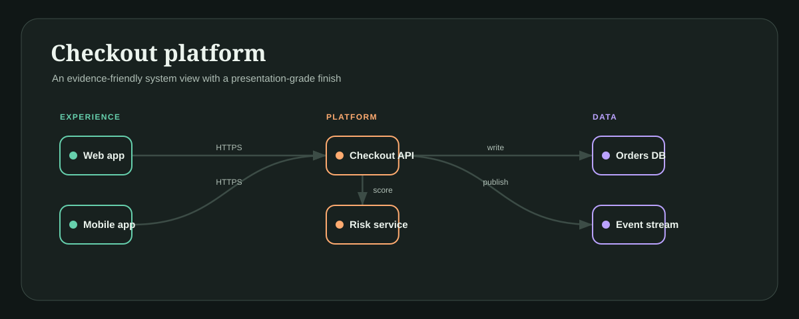
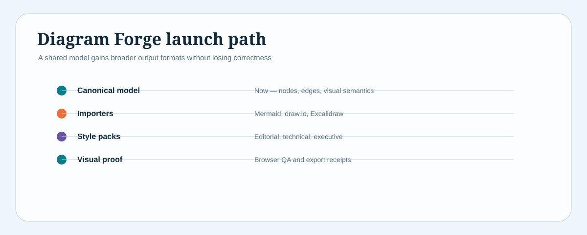

# Diagram Forge

**Validated JSON in. Presentation-ready SVG out. Nothing else.**

Diagram Forge compiles a small JSON model into a single self-contained HTML file
(or raw SVG). It has no dependencies, no network calls, and produces
byte-identical output for identical input — so diagrams live in git and run in CI
like any other build artifact. It is deliberately small (~130 lines): one graph
renderer for boxes-and-arrows shapes and one editorial renderer for timelines,
matrices, and bars, dressed by four themes.

It is **not** a Mermaid replacement, not an auto-layout research project, and
does no automatic layout for arbitrary graphs — it lays out grouped columns. What
it does, it does predictably.

## See it in action

<p align="center">
  <a href="docs/gallery/product-architecture.svg">
    
  </a>
</p>

<p align="center"><strong>Architecture</strong> · grouped components, semantic connections, and the <code>midnight</code> theme</p>

<p align="center">
  <a href="docs/gallery/launch-roadmap.svg">
    
  </a>
</p>

<p align="center"><strong>Roadmap</strong> · the same compiler in the <code>ocean</code> editorial family</p>

## What works today

**12 model types across two layout engines:**

- **Graph** (7): `architecture`, `dataflow`, `workflow`, `sequence`,
  `lifecycle`, `hierarchy`, `journey` — grouped nodes, curved connectors, arrows.
- **Editorial** (5): `timeline`, `roadmap`, `comparison`, `matrix`, `chart` —
  timeline dots, matrix cards, or horizontal value bars.

**Four themes** tuned for slides and docs, light and dark: `paper`, `midnight`,
`ocean`, `ember`.

**Validated before render.** Unknown types, missing titles, duplicate node ids,
edges pointing at unknown nodes, and empty datasets fail loudly with a message —
not a blank canvas:

```bash
$ node bin/diagram-forge.mjs check broken.json
✗ Duplicate node id "api".
✗ Edge web → cache references an unknown node.

$ node bin/diagram-forge.mjs check examples/product-architecture.json
✓ architecture: Checkout platform is structurally valid
```

**Static, accessible SVG:** `role="img"` with linked `<title>` and `<desc>`. No
scripts, no animation, no runtime dependency, no network request.

## Try it

```bash
# render an example to a self-contained HTML file, then open it
node bin/diagram-forge.mjs render examples/product-architecture.json dist/product-architecture.html --theme midnight
open dist/product-architecture.html

# or emit raw SVG
node bin/diagram-forge.mjs render examples/product-architecture.json dist/product-architecture.svg --theme midnight

# validate without rendering
node bin/diagram-forge.mjs check examples/product-architecture.json

# run the test suite
npm test
```

## The model

```json
{
  "type": "architecture",
  "title": "Checkout platform",
  "subtitle": "One canonical model, many visual treatments",
  "nodes": [
    { "id": "web", "label": "Web app", "group": "Experience", "kind": "app" },
    { "id": "api", "label": "Checkout API", "group": "Platform", "kind": "service" }
  ],
  "edges": [{ "from": "web", "to": "api", "label": "HTTPS" }]
}
```

Graph types share the canonical `nodes` / `edges` model. Editorial types use
`items`, `series`, or `rows` instead. See [`examples/`](examples).

## Product architecture

```text
JSON model → validate → type router → graph | editorial renderer → SVG
                                                                    ↓
                                            self-contained, presentable HTML
```

The boundary is intentional: content semantics stay in the model; visual
treatment lives in themes and renderers. The model is designed so a future
importer *could* target it — translating Mermaid or draw.io into the model
without inheriting their layout or styling.

## Not built yet

These are on the roadmap, deliberately kept out of the feature list above:

- [ ] Importers for Mermaid, draw.io, and Excalidraw.
- [ ] Automatic type recommender and JSON schema files.
- [ ] View modes, PNG/PDF export, and browser visual regression checks.
- [ ] Authored style packs and a plugin API for new visual types.

## Requirements

Node >= 20. Zero runtime dependencies. MIT licensed.

## License and provenance

Diagram Forge was built after acquiring copies of and studying the MIT-licensed
[Diagram Design](https://github.com/cathrynlavery/diagram-design) and
[Archify](https://github.com/tt-a1i/archify) projects. They informed its product
direction; this repository is an original implementation.

MIT. See [THIRD_PARTY_NOTICES.md](THIRD_PARTY_NOTICES.md) for the open-source
projects that informed the product direction.
